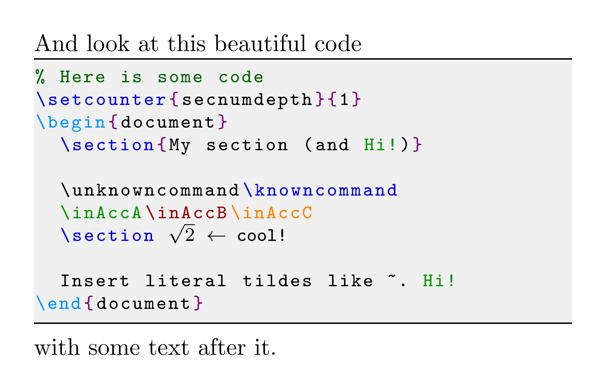

<!-- ---
title: "Package highlight-latex manual"
author: Vincent Kuhlmann
date: 15 March 2021
geometry: margin=2cm
output: pdf_document
---
-->

# Highlight LaTeX: Pretty LaTeX code within LaTeX

Teaching other people LaTeX is great fun, and I've seen plenty of slides and
readers doing so. You show what you achieve, and how you achieve it. However,
while the LaTeX you achieve might look splendid, showing code is often done
using very rudimentary solutions (like plain old verbatim).

They're not to blame: I didn't find pretty colored LaTeX highlighting either. I
sure want it, and if you're reading this, you probably too, so I've made a
package for it! It builds further on the generic `listings` package to provide
colored highlighting for LaTeX. The file `demo.tex` achieves this:



<!--  -->

## Manual installation

1. Download the `.sty` file, e.g.
[right click here and select 'save as'](https://github.com/vkuhlmann/highlight-latex/raw/main/highlightlatex.sty).
2. Copy the file to the directory where your `.tex` file is at...
3. ... or make it available for all your `.tex` files by placing the file in
   your TEXMF root.

   **Locating TEXTMF root**

   Note the following default locations:

       MiKTeX on Windows:
         global installation: C:\Program Files\MiKTeX\tex\latex
         local installation: %AppData%\..\Local\Programs\MiKTeX\tex\latex
        
       TeX Live on Linux or Mac:
         /usr/share/texmf-texlive/tex/latex
         /usr/local/texlive/texmf-local/tex/latex

   On Windows you can open a path by pasting the address in the Windows Explorer
   address bar, or pressing <kbd>Start</kbd>+<kbd>R</kbd> and pasting the
   address there. One of these directories should contain a long list of
   packages you have installed. If you can't it, and you use MiKTeX, open MiKTeX
   Console and open the directories listed under `Settings > Directories` with
   `Purpose` set to `Install`. Doesn't it exist? Append a `tex` or `latex`
   directory to the path.

   **Adding the package**

   Add a new directory called `highlightlatex` and place the `.sty` file in it.
   Then refresh the file name database:
   * For MiKTeX on Windows open MiKTeX Console and execute `Tasks > Refresh file
     name database`.
   * For TeX Live on Linux or Mac, execute in a terminal `sudo texhash`.
4. Add `\usepackage{highlightlatex}` to your `.tex` file.
5. For usage of this package, consult the demo files, or read the
   documentation below.

## Getting started

After having added the package, you can add LaTeX in two ways:
* Inline style:

      Your file begins with a line of the form \hll|\documentclass[]{}|. The
      square brackets ...

  The first non-space character following `\hll` is delimits the argument to
  this command.

* Block style:

      Your basic document now looks like
      \begin{highlightblock}[gobble=2]
          \documentclass[a4paper]{article}
          \begin{document}
              Hello world!
          \end{document}
      \end{highlightblock}

  To prevent indentation of our `highlightblock` (here one tab), to be shown as
  part of the code, the `gobble` parameters strips them off. Play around with
  it until everything looks right. I recommend to set this value globally using
  `\def\defaultgobble{2}`. You can still override that, if necessary.

  There are situations where width of the block could run out of the page. For
  example, when using beamer and storing a block as described in the section
  'Fragile breaking situations', the normal full-width of a slide is assumed.
  If you use multiple columns, set the `linewidth` on the `highlightblock`.
  This can be a fraction of the total slide width available, `0.6\textwidth`
  is 60% of the width, or an absolute value, like `10em`, which seems to equal
  20 characters.

  There are more keys you can provide. Check the
  [listings package documentation](https://www.ctan.org/pkg/listings) for
  options available to the `lstlisting`-environment and `lstset` command.

## Adding a command to a highlighting rule

By default, only some LaTeX commands will be highlighted in blue. If there are
others you need, like `\tableofcontents` and `\figref`, update the highlighting
rules:
```
\updatehighlight{
	name = default,
	add = {
		\tableofcontents, \figref
	}
}
```

The changes will affect only code after it. For a use as this example, I
recommend putting it in your preamble (before the `\begin{document}`).

## Custom highlighting rules

As shown `demo.tex`, you can put any command or keyword you want to highlight on
in a different color. You do this with
```
\updatehighlight{
    % A name like 'focus' or 'orange' would be more descriptive,
    % this is just to show you can make up the name yourself.
    name = orangejuice,
    color = orange,
    add = {
        \tableofcontents
    }
}
```

You can use the `xcolor` syntax for describing colors as well. If you find the
orange too bright, you can replace it with `orange!90!black`: 90% orange,
remaining is black. For more information on color definitions and name, refer to
[LaTeX/Colors on Wikibooks](https://en.wikibooks.org/wiki/LaTeX/Colors).

---

The argument to `\updatehighlight` is a key-value list. Keys are processed
sequentially. For example, use `color` before rather than after the `add`, and
a key can appear multiple times. Each one will be processed. You can merge any
two `\updatehighlight` in one. No need to close and reopen `\updatehighlight`
for each highlighting rule.

You might be tempted to add a blank line for clarity; that means a new paragraph
too LaTeX, don't do it. Instead, just put a line with only a `%` sign. Spacing
within the argument is often irrelevant. If you need a comma in the value,
surround your value with braces.

The possible keys are:

* **name**: Create or modify a named rule. This key is optional.

  The default keys are `default`, which includes a bunch of basic commands,
  and has by default a dark blue color, and `structure`, which consists of
  `\begin` and `\end` and prints them in light blue.

  _Deprecated alias: label_

* **classoffset**: Set the `listings` classoffset manually. Try to avoid this.
  Use **name** to refer to existing rules instead.

* **add**: Add a commands (`\mycommand`) oor keywords (`Hi!`) to the current
  rule. The value can contain multiple values by opening braces, and comma
  separating values within them.

  _Deprecated aliases: macros (only for commands), commands (only for commands),
  and keywords (only for keywords)_

* **remove**: Remove a commands or keywords from the current rule. The value can
  contain multiple values by opening braces, and comma separating values within
  them.

* **clear**: Remove all commands and keywords from the current rule. Use without
  value, for example

      \updatehighlight{
          name = default,
          clear
      }

* **color**: Specify a color for the rule. Equivalent to specifying **style**
  instead, with value `\color{value}` where `value` is the value for the
  **color** key. So `color=red` and `style=\color{red}` are equivalent.

* **style**: Specify a style for the rule. A rule can only have one style. If
  you specify a style after `add`, `remove`, `keywords` (deprecated), `macros`
  (deprecated) or `commands` (deprecated), this starts a new (unnamed) rule.
  In practice, the only style which will probably work for you is only a color,
  so just use it instead. But hey, you have the option if you want to. :)

## Global settings
There are some global parameters involved in the appearance:
```
\colorlet{curlyBrackets}{red!50!blue}
\colorlet{squareBrackets}{blue!50!white}
\colorlet{codeBackground}{gray!10!white}
\colorlet{comment}{green!40!black}
\def\defaultgobble{0}
```

Each line can be set independent of eachother, and each shows its default value.

There are package options you can use as well:

* **frame** (default `lines`): specify the frame you want around code. My
  favorites are `lines` and `none`. Check the
  [listings package documentation](https://www.ctan.org/pkg/listings) for all
  possibilities.

* **noframe** (use without value): equivalent to `frame=none`.

* **styleanywhere** (use without value): override the default behavior that
  `style` starts a new style after commands like `add` and `remove`.

## Fragile breaking situations (like beamer frames)

When passing command arguments around, or storing environment content, LaTeX
interprets all characters. This includes seeing `\maketitle` in `\hll|\maketitle|`
as a real command. To prevent this behavior, everything from `\verb`, to the
`verbatim`-environment, to the `listings` package the highlight LaTeX package
uses temporarily changes the interpretation of characters that are still to be
read. The blackslash before maketitle in `\hll|\maketitle|` will be read as
'just text' (a _letter_ technically).

When content has already been interpreted, like the `frame`-environment in
`beamer` does, this trick can't be done anymore. Instead, you either need to
_escape_ code, or _pre-process_ the code outside a fragile breaking situation.

Escaping is done by preceding the special character with a backslash. For
example, `\hll|\documentclass[]{}|` becomes `\hll|\\documentclass[]\{\}|`.

For large code blocks, this is undesirable. Therefore, the package provides for
a companion to the `highlightblock`-environment: surround it with a `saveblock`
environment which takes a single argument: a name to assign it. We use it to
refer to it later. For example:
```latex
\begin{saveblock}{basicfigure}
    \begin{highlightblock}[linewidth=0.6\textwidth]
        \begin{figure}
            \includegraphics
            [width=0.9\linewidth]
            {myPlot.pdf}
            
            \caption{My plot}
            \label{fig:myplot}
        \end{figure}
    \end{highlightblock}
\end{saveblock}
```

Do this outside a fragile breaking situation. (For the `frame`-environment
example, that means just before the `frame` for example.) Then, where you want
to use it, use `\useblock{basicfigure}`. There is also a variant
`\consumeblock{basicfigure}`. If you save many blocks, these will all remain
loaded in memory till your PDF has fully generated. The `\consumeblock` works
like `\useblock`, except the saved block is deleted from memory after its use.
Note this can also result in unexpected behavior, for example animations in a
beamer frame might need the code line to be executed multiple times. Use
`\useblock` when you can't make the guarantee the last use of a block.

Fragile breaking situations has it's own demo, which you find at
`deamerdemo/deamerdemo.tex`.

## Adding extra space

By default, highlight-latex follows an approach where it minimizes spacing.
This gives you full control over how tight or spacious your document looks.
Just use commands like `\medskip` to add extra spacing. The package doesn't
currently include an option to have that done everywhere automatically.

## License

The package is available under MIT License. See LICENSE.txt.

